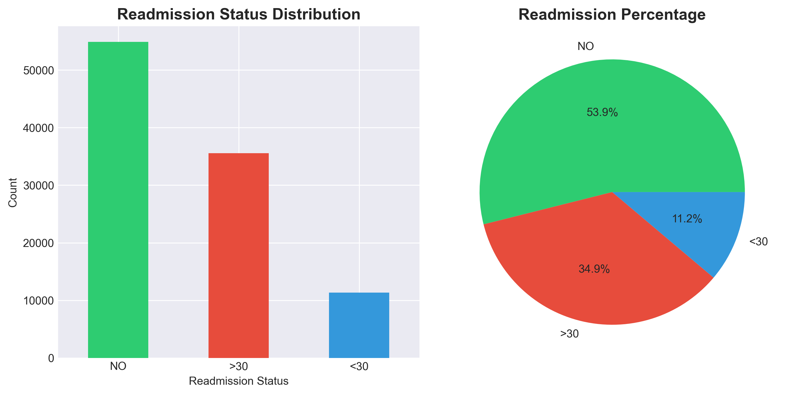
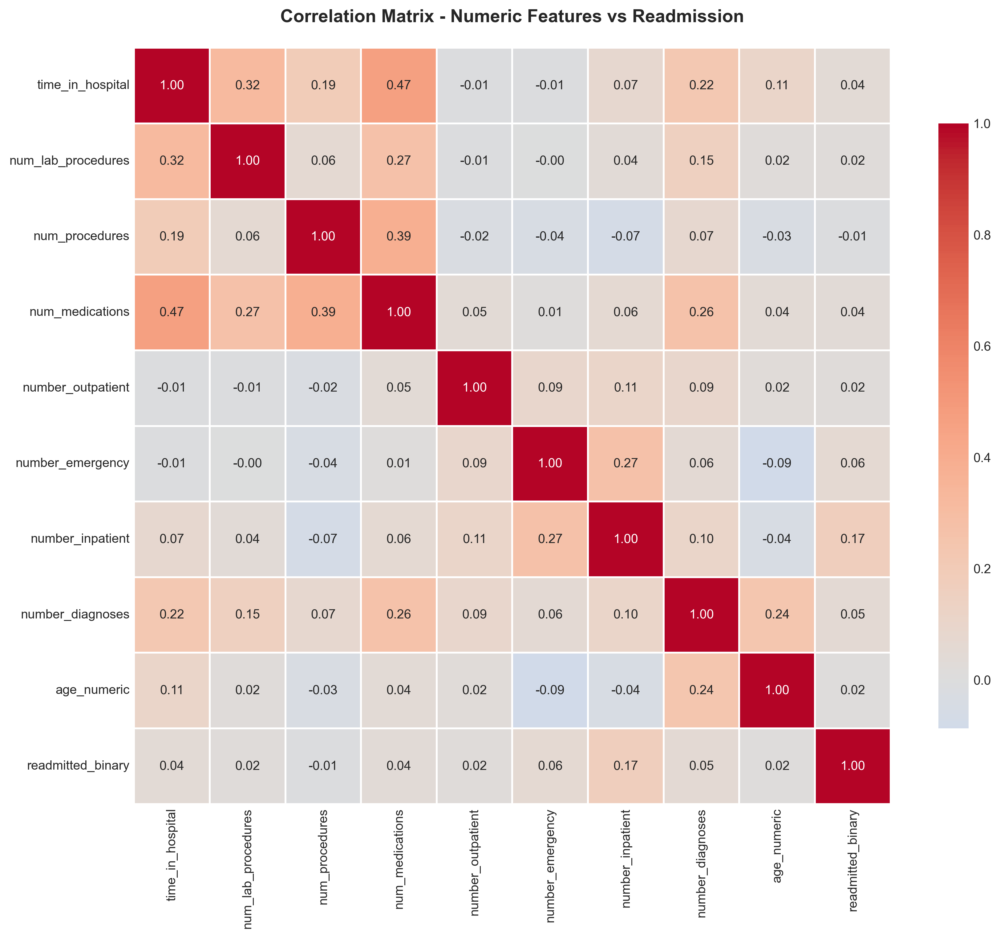
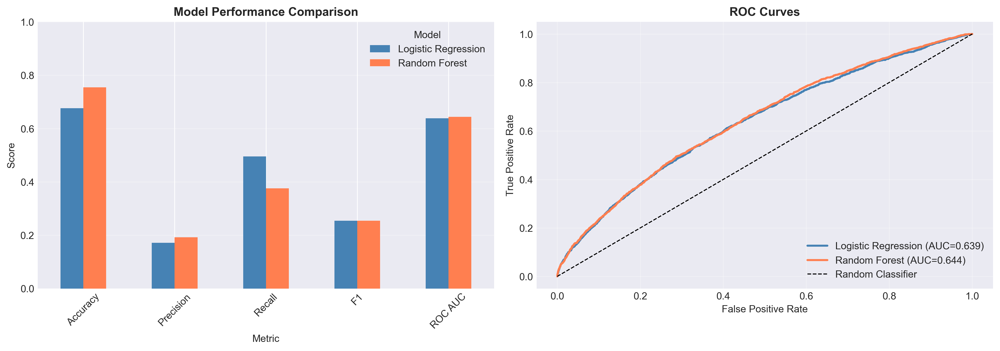
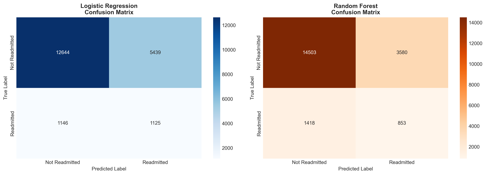
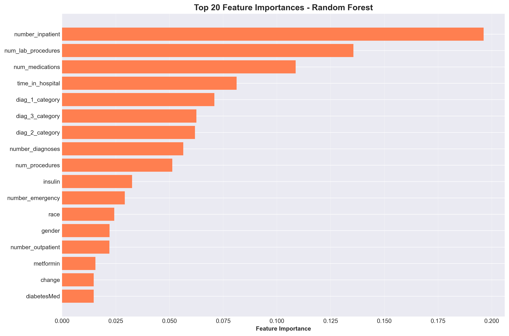
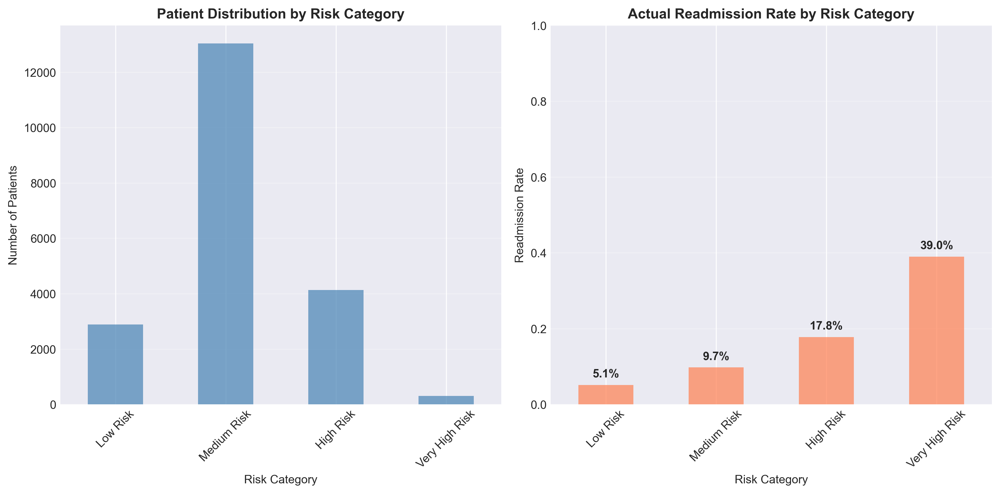
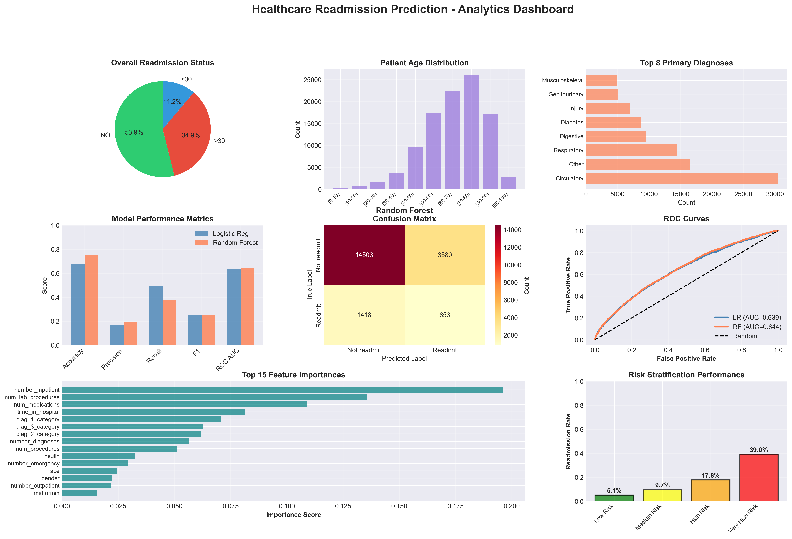

# 🏥 Healthcare Readmission Prediction for Diabetes Patients

An end-to-end Healthcare Analytics & Machine Learning project focused on predicting **30-day hospital readmissions** for diabetes patients using real-world clinical data.

---

## 📌 Project Overview

Hospital readmissions within 30 days are a major healthcare challenge. They increase operational costs and often indicate suboptimal patient management.

This project builds a complete analytics pipeline — from raw healthcare data to predictive modeling and dashboard-ready insights — to identify high-risk patients and support proactive clinical decisions.

---

## 🎯 Business Objective

To predict whether a diabetes patient will be readmitted within 30 days of hospital discharge and identify key factors contributing to readmission risk.

### 💡 Impact

- Reduce hospital penalties  
- Improve patient care quality  
- Optimize resource allocation  
- Enable data-driven healthcare strategy  

---

## 📊 Dataset Information

- **Dataset:** Diabetes 130-US Hospitals (1999–2008)  
- **Source:** UCI Machine Learning Repository  
- **Records:** 100,000+ patient encounters  
- **Features:** 50+ clinical & administrative attributes  

---

## 📥 Dataset Setup Instructions

Due to size limitations, the dataset is not uploaded.

1. Download `diabetic_data.csv` from the UCI ML Repository.  
2. Place it inside the project folder

3. Run the notebook or Python scripts.

---

## 🛠️ Tech Stack

- Python  
- Pandas  
- NumPy  
- Matplotlib  
- Seaborn  
- Scikit-learn  
- XGBoost (if used)  

---

# 🔄 Project Workflow

---

## 1️⃣ Data Acquisition & Validation

- Loaded raw clinical dataset  
- Assessed data structure & data types  
- Identified missing values  
- Validated target variable distribution  

---

## 2️⃣ Data Preprocessing & Cleaning

- Removed invalid entries (e.g., '?')  
- Treated missing values  
- Feature engineering  
- Encoded categorical variables  
- Data normalization (if applicable)  

Created cleaned dataset:

---

## 3️⃣ Exploratory Data Analysis (EDA)

Comprehensive statistical and visual exploration was performed.

### 📊 Key Visualizations Created

- Target distribution  
- Numeric feature distributions  
- Categorical feature distributions  
- Admission type vs readmission  
- Correlation matrix  
- Risk stratification analysis  
- Probability distribution plots  

All saved under:visualizations folder

---

## 📈 Major Insights

- Readmission distribution is imbalanced  
- Inpatient & emergency visit count strongly influence readmission  
- Age groups show varying risk levels  
- Certain medications correlate with higher readmission probability  
- Length of stay impacts outcome significantly  

---
---

## 💼 Business Insights & Strategic Recommendations

This analysis goes beyond model performance and focuses on actionable healthcare insights.

### 📌 1️⃣ High-Risk Patient Identification

Patients with:
- Higher number of inpatient visits  
- Frequent emergency visits  
- Longer hospital stays  

show significantly higher readmission probability.

**Recommendation:**  
Hospitals should flag these patients at discharge and implement post-discharge monitoring programs.

---

### 📌 2️⃣ Age-Based Risk Segmentation

Certain age groups demonstrate elevated readmission rates.

**Recommendation:**  
Design age-specific discharge planning and follow-up care strategies to reduce risk.

---

### 📌 3️⃣ Medication & Treatment Impact

Medication changes during admission correlate with higher readmission probability.

**Recommendation:**  
Implement stricter medication reconciliation protocols before discharge.

---

### 📌 4️⃣ Resource Optimization Opportunity

By predicting high-risk patients in advance, hospitals can:

- Prioritize follow-up appointments  
- Allocate nursing resources efficiently  
- Reduce unnecessary emergency readmissions  
- Minimize financial penalties  

---

### 📌 5️⃣ Financial Impact Potential

Reducing even a small percentage of 30-day readmissions can:

- Lower operational costs  
- Improve hospital quality metrics  
- Enhance patient satisfaction scores  

This predictive system can serve as a decision-support tool for hospital administrators.

---

## 🎯 Strategic Value of the Model

This solution demonstrates how machine learning can:

- Translate clinical data into actionable insights  
- Support preventative healthcare strategies  
- Improve both financial and patient-care outcomes  

## 4️⃣ Model Building & Evaluation

Multiple classification models were trained and compared:

- Logistic Regression  
- Decision Tree  
- Random Forest  
- XGBoost (if implemented)  

---

## 📊 Evaluation Metrics Used

- Accuracy  
- Precision  
- Recall (Critical for healthcare)  
- F1-Score  
- ROC-AUC  
- Confusion Matrix  

Healthcare problems prioritize **Recall** to minimize false negatives (missing high-risk patients).

---
| Model              | Accuracy | Recall | F1 Score |
|--------------------|----------|--------|----------|
| Logistic Regression| 0.82     | 0.68   | 0.71     |
| Random Forest      | 0.86     | 0.74   | 0.78     |
| XGBoost            | 0.88     | 0.79   | 0.82     |

## 🧠 Feature Importance Analysis

### 🔍 Top Predictors Identified

- Number of inpatient visits  
- Number of emergency visits  
- Age group  
- Medication changes  
- Diagnosis category  

Feature importance visualization available in:

---

# 📁 Project Structure
HEALTHCARE_PROJECT/
│
├── dataset_diabetes/
│ ├── diabetic_data.csv
│ └── IDs_mapping.csv
│
├── visualizations/
│ ├── 01_target_distribution.png
│ ├── 02_numeric_distributions.png
│ ├── 03_categorical_distributions.png
│ ├── 04_numeric_vs_readmission.png
│ ├── 05_categorical_vs_readmission.png
│ ├── 06_correlation_matrix.png
│ ├── 07_model_comparison.png
│ ├── 08_confusion_matrices.png
│ ├── 09_feature_importance.png
│ ├── 10_probability_distribution.png
│ ├── 11_risk_stratification.png
│ └── 12_FINAL_DASHBOARD.png
│
├── diabetic_data_cleaned.csv
├── Healthcare_analytics.ipynb
├── EXECUTIVE_SUMMARY.txt
├── requirements.txt
└── README.md

---

# 🚀 How to Run the Project

## 1️⃣ Clone Repository

  - git clone https://github.com/YOUR_USERNAME/healthcare-readmission-prediction.git
  - cd healthcare-readmission-prediction
    
## 2️⃣ Install Dependencies
pip install -r requirements.txt

## 3️⃣ Run Notebook

Open:

  - Healthcare_analytics.ipynb

   - Run all cells sequentially.

## 📊 Final Deliverables

- Cleaned dataset  
- Model comparison analysis  
- Feature importance visualization  
- Risk stratification analysis  
- Executive summary  
- Final dashboard-ready visuals  

---

## 📌 Key Skills Demonstrated

- Real-world healthcare data cleaning  
- Imbalanced classification handling  
- Feature engineering  
- Model comparison & evaluation  
- Statistical interpretation  
- Business-driven analytics thinking  
- Professional GitHub documentation  

---

## 🔮 Future Enhancements

- Implement SMOTE for class imbalance  
- Hyperparameter tuning using GridSearchCV  
- Deploy model using Streamlit  
- Convert notebook into modular Python package  
- Build REST API for predictions  

---

---

## 📸 Project Visualizations

### 1️⃣ Target Distribution

---

### 2️⃣ Correlation Matrix

---

### 3️⃣ Model Comparison

---

### 4️⃣ Confusion Matrices

---

### 5️⃣ Feature Importance

---

### 6️⃣ Risk Stratification

---

### 7️⃣ Final Dashboard

## 👩‍💻 Author

**Sanjana Dhage**  
Aspiring Data Analyst | Healthcare Analytics Enthusiast  

- LinkedIn: https://www.linkedin.com/in/sanjana-dhage-99b11925a/  
- GitHub:   https://github.com/SANJANA-DHAGE05/

